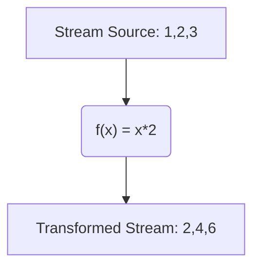
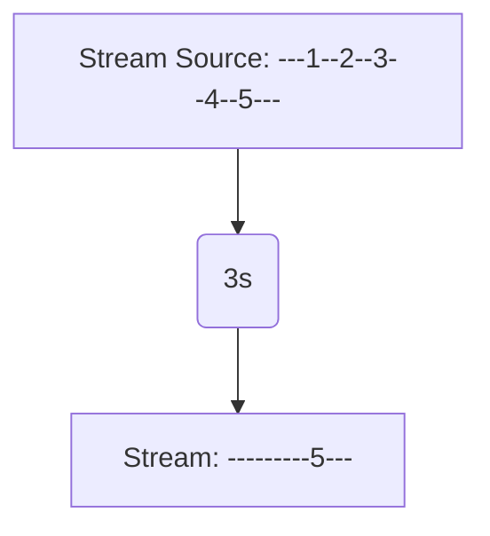
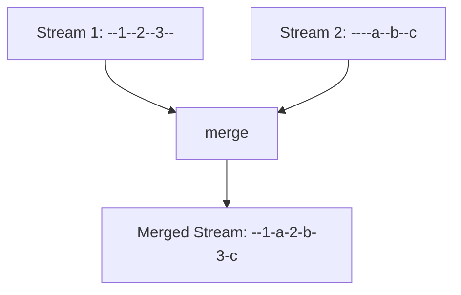
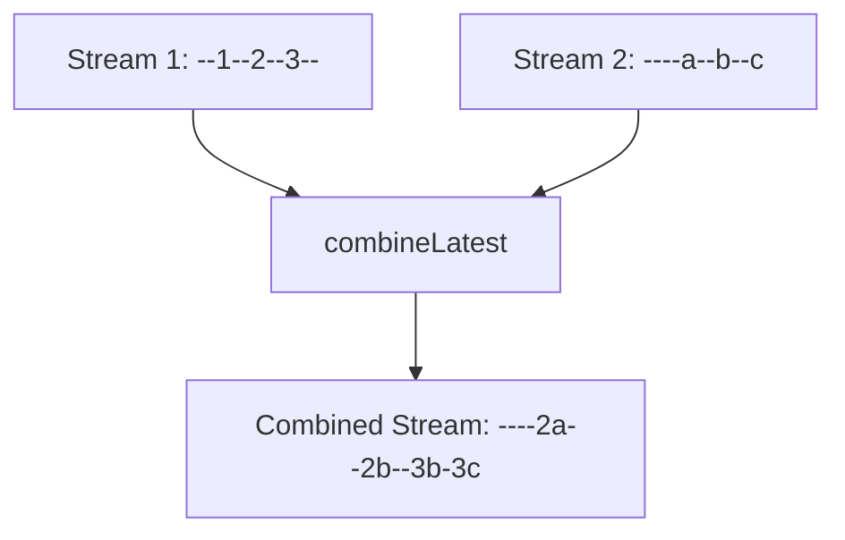
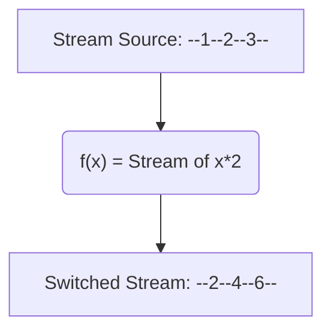
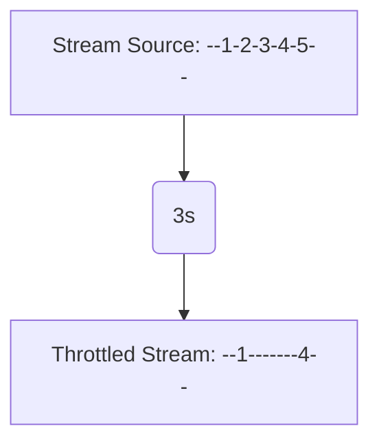

# Flutter : Vos flux de données en Stream

> Medium: [https://medium.com/@benotfontaine/flutter-streams-59153dddee14](https://medium.com/@benotfontaine/flutter-streams-59153dddee14)

Dans le monde du développement logiciel, la gestion des données en temps réel est souvent une source de complexité. Imaginons une application où les données peuvent être modifiées à tout moment, par différentes sources, et où ces modifications doivent être reflétées instantanément dans l'interface utilisateur. Comment gérer efficacement ces flux de données dynamiques ? C'est ici que les **Streams** entrent en jeu.

Un Stream est une séquence d'événements asynchrones. Il permet de "s'abonner" à des sources de données et de réagir à chaque nouvelle donnée produite. Au lieu de demander activement des données, avec un Stream, les données sont "poussées" vers le consommateur dès qu'elles sont disponibles. Cette approche résout le problème de la synchronisation des données en temps réel en offrant un moyen élégant de gérer les flux de données asynchrones.

Mais d'où vient cette idée de programmation basée sur les flux de données ? Remontons un peu dans le temps. La **programmation réactive** a été popularisée par Microsoft avec l'introduction de Reactive Extensions (Rx) dans les années 2010. L'idée était de fournir aux développeurs un cadre pour gérer les événements asynchrones et les flux de données de manière déclarative. Au lieu de se perdre dans les méandres des callbacks et des gestionnaires d'événements, les développeurs pouvaient désormais traiter les flux de données comme des collections, en utilisant des opérateurs familiers tels que `map`, `filter` et `reduce`.

L'impact de la programmation réactive sur le développement logiciel a été profond. Elle a offert une nouvelle manière de penser et de structurer le code, rendant les applications plus lisibles, maintenables et robustes face aux complexités asynchrones. Et avec l'essor des applications web et mobiles en temps réel, la nécessité d'une telle approche n'a fait que croître.

Flutter, le framework UI de Google, n'est pas en reste. Conçu dès le départ avec la programmation réactive à l'esprit, Flutter intègre profondément le concept de Stream dans son architecture. Que ce soit pour gérer les entrées utilisateur, les animations ou les communications réseau, Flutter s'appuie sur les Streams pour offrir une expérience utilisateur fluide et réactive.

# Streams

Lorsque nous parlons de programmation asynchrone, nous pensons souvent aux `Futures` en Dart, qui représentent des valeurs potentielles, ou des erreurs, qui seront disponibles à un moment donné dans le futur. Cependant, Dart va au-delà des simples `Futures` avec un autre puissant concept : les **Streams**.

## Qu'est-ce qu'un Stream ?

Un Stream, dans le contexte de Dart, est une séquence d'événements asynchrones. Vous pouvez imaginer un Stream comme un tuyau par lequel des données (ou des erreurs) peuvent passer. Ces données peuvent être produites n'importe quand, ce qui rend les Streams particulièrement adaptés pour gérer des flux de données qui ne sont pas disponibles immédiatement, comme les entrées utilisateur, les fichiers lus depuis un disque ou les données reçues via le réseau.

## Comment créer et écouter un Stream

Créer un Stream en Dart est simple. Voici un exemple basique :

```dart
Stream<int> countStream(int maxCount) async* {
  for (int i = 1; i <= maxCount; i++) {
    await Future.delayed(Duration(seconds: 1));
    yield i;
  }
}

```

Dans cet exemple, `countStream` est un Stream qui émet des nombres de 1 à `maxCount` toutes les secondes. Le mot-clé `async*` indique que c'est une fonction génératrice asynchrone, et `yield` est utilisé pour émettre une valeur dans le Stream.

Pour écouter un Stream, vous utilisez la méthode `listen` :

```dart
final stream = countStream(5);
stream.listen((data) {
  print('Received: $data');
}, onError: (error) {
  print('Error: $error');
}, onDone: () {
  print('Stream completed');
});

```

## Utilisation d'un Stream dans Flutter

Flutter intègre naturellement les Streams grâce au widget `StreamBuilder`. Ce widget se reconstruit chaque fois qu'une nouvelle donnée est émise par le Stream, permettant une mise à jour dynamique de l'interface utilisateur.

```dart
StreamBuilder<int>(
  stream: countStream(5),
  builder: (context, snapshot) {
    if (snapshot.hasError) {
      return Text('Error: ${snapshot.error}');
    }
    if (!snapshot.hasData) {
      return CircularProgressIndicator();
    }
    return Text('Count: ${snapshot.data}');
  },
)

```

Avec `StreamBuilder`, vous n'avez pas besoin de gérer manuellement les états de chargement, d'erreur ou de données disponibles. Le widget s'en occupe pour vous, rendant votre code plus propre et plus lisible.

# RxDart

RxDart est une extension de la bibliothèque Dart `Stream` qui introduit des fonctionnalités supplémentaires inspirées de la programmation réactive. Elle est basée sur le concept de la programmation réactive, qui, comme nous l'avons vu précédemment, a été popularisée par Microsoft et a trouvé sa place dans de nombreux langages et cadres, y compris Dart et Flutter.

## Pourquoi RxDart ?

Bien que Dart offre des fonctionnalités asynchrones puissantes avec ses `Futures` et `Streams`, RxDart vient compléter ces outils en introduisant une gamme d'opérateurs qui permettent de manipuler, combiner, transformer et réagir aux valeurs émises par les Streams de manière plus expressive.

## Opérateurs RxDart

Voici quelques-uns des opérateurs les plus couramment utilisés en RxDart, accompagnés de schémas pour illustrer leur fonctionnement :

1. **map** : Transforme les éléments émis par le Stream en fonction d'une fonction donnée.



1. **debounceTime** : Retarde les valeurs émises par le Stream d'une durée spécifiée.



1. **merge** : Combine plusieurs Streams en un seul Stream.



1. **combineLatest** : Prend les dernières valeurs de plusieurs Streams et les combine.



1. **switchMap** : Transforme chaque valeur émise en un nouveau Stream.



1. **throttleTime** : Émet une valeur puis ignore les suivantes pendant une durée spécifiée.



Chaque schéma illustre le fonctionnement de l'opérateur en montrant comment il transforme le Stream source en un nouveau Stream.

# Illustration

Lorsque nous parlons d'une application météo, nous pensons souvent à des données qui sont mises à jour régulièrement, comme les prévisions météorologiques, la température actuelle, le taux d'humidité, etc. Ces données peuvent être idéalement représentées et gérées à l'aide de Streams et de RxDart.

Imaginons que nous ayons une API qui nous fournit les données météorologiques. Nous pouvons créer un Stream qui émet ces données à intervalles réguliers :

```dart
Stream<WeatherData> getWeatherUpdates() async* {
  while (true) {
    await Future.delayed(Duration(minutes: 30)); // Mettre à jour toutes les 30 minutes
    final data = await fetchWeatherDataFromAPI();
    yield data;
  }
}

```

Ici, `WeatherData` est une classe qui contient toutes les informations météorologiques nécessaires.

## Utilisation de RxDart pour manipuler les données

Avec RxDart, nous pouvons facilement manipuler et transformer les données avant de les afficher à l'utilisateur. Par exemple, si nous voulons convertir la température de Celsius à Fahrenheit :

```dart
final temperatureStream = getWeatherUpdates().map((data) {
  return data.temperatureInCelsius * 9/5 + 32; // Conversion en Fahrenheit
});

```

Supposons maintenant que nous voulions combiner les données météorologiques de deux villes différentes. Avec l'opérateur `combineLatest2` de RxDart, c'est un jeu d'enfant :

```dart
final combinedWeatherStream = Rx.combineLatest2(
  getWeatherUpdates(city: 'Paris'),
  getWeatherUpdates(city: 'New York'),
  (weatherParis, weatherNewYork) => CombinedWeather(weatherParis, weatherNewYork)
);

```

## Affichage des données dans Flutter

Flutter rend l'écoute et l'affichage des données d'un Stream très simple grâce au widget `StreamBuilder` :

```dart
StreamBuilder<WeatherData>(
  stream: getWeatherUpdates(),
  builder: (context, snapshot) {
    if (snapshot.hasError) {
      return Text('Erreur : ${snapshot.error}');
    }
    if (!snapshot.hasData) {
      return CircularProgressIndicator();
    }
    return Text('Température : ${snapshot.data.temperature}°C');
  },
)

```

Comme vous pouvez le voir, les Streams et RxDart offrent une manière puissante et flexible de gérer des données asynchrones en Dart et Flutter. Ils permettent de manipuler, transformer et combiner des données de manière déclarative, rendant le code plus propre et plus lisible. 

# Injection de dépendance avec `get_it` et `injectable`

L'injection de dépendance est une technique de conception logicielle qui permet d'injecter des dépendances (services ou objets) dans une classe plutôt que de les créer à l'intérieur de cette classe. Elle favorise la séparation des préoccupations, la réutilisabilité du code et facilite les tests unitaires.

**Pourquoi utiliser l'injection de dépendance ?**

1. **Séparation des préoccupations** : Chaque composant ou service se concentre sur sa propre logique sans se soucier de la création ou de la gestion de ses dépendances.
2. **Testabilité** : Il est plus facile de remplacer des dépendances réelles par des mockups lors des tests.
3. **Réutilisabilité** : Les services peuvent être réutilisés dans différentes parties de l'application sans avoir à les recréer.

**Introduction à `get_it` et `injectable`**

- **get_it** : C'est un service locator pour Dart et Flutter, ce qui signifie qu'il fournit un accès global à vos instances. Il ne dépend pas du framework Flutter, vous pouvez donc l'utiliser dans n'importe quel projet Dart.
- **injectable** : C'est un générateur de code pour `get_it`. Il génère automatiquement le code d'enregistrement pour vos services, réduisant ainsi le boilerplate.

**Installation et configuration**

1. Ajoutez les dépendances à votre `pubspec.yaml` :
    
    ```yaml
    dependencies:
      get_it: 
      injectable: 
    
    dev_dependencies:
      build_runner: 
      injectable_generator: 
    
    ```
    
2. Exécutez `pub get` pour installer les dépendances.
3. Créez vos services et utilisez les annotations fournies par `injectable` pour marquer vos classes. Par exemple, pour un service météo :
    
    ```dart
    @Injectable()
    class WeatherService {
      Future<WeatherData> fetchWeather(String city) {
        // Logique pour récupérer les données météo
      }
    }
    
    ```
    
4. Exécutez la commande suivante pour générer le code d'enregistrement :
    
    ```
    flutter pub run build_runner build
    
    ```
    
5. Utilisez `get_it` pour accéder à vos services dans votre application :
    
    ```dart
    final getIt = GetIt.instance;
    
    void setupLocator() {
      // Ceci est généré automatiquement par injectable
      $initGetIt(getIt);
    }
    
    void main() {
      setupLocator();
      runApp(MyApp());
    }
    
    ```
    

## Intégration dans notre application météo

Supposons que nous ayons un service `WeatherService` qui interagit avec une API pour obtenir les données météo. Avec l'injection de dépendance, nous pouvons facilement injecter ce service dans n'importe quel widget ou autre service.

Marquez le service avec l'annotation `@injectable` :

```dart
@Injectable(as: WeatherService)
class WeatherApiService implements WeatherService {
  @override
  Future<WeatherData> fetchWeather(String city) {
    // Logique pour récupérer les données météo
  }
}

```

Dans votre widget ou bloc, accédez au service :

```dart
final weatherService = getIt<WeatherService>();
final weatherData = await weatherService.fetchWeather('Paris');

```

L'injection de dépendance, avec l'aide de `get_it` et `injectable`, offre une manière structurée et efficace de gérer les dépendances dans une application Dart ou Flutter. Elle facilite la testabilité, la réutilisabilité et la séparation des préoccupations, rendant le code plus propre et maintenable.

# Clean Architecture dans Flutter

La Clean Architecture est une approche de conception logicielle qui vise à séparer les préoccupations de manière à rendre le code modulaire, évolutif et testable. Elle est basée sur l'idée de dépendre d'abstractions et non de détails concrets.

**Pourquoi utiliser la Clean Architecture ?**

1. **Séparation des préoccupations** : Chaque couche a une responsabilité claire, ce qui facilite la maintenance et la compréhension du code.
2. **Indépendance du framework** : Le cœur de l'application (domaine) ne dépend pas des détails tels que les bases de données, les interfaces utilisateur ou les frameworks externes.
3. **Testabilité** : En séparant les préoccupations, il est plus facile de tester chaque couche individuellement.
4. **Évolutivité** : Ajouter de nouvelles fonctionnalités ou modifier des fonctionnalités existantes devient plus simple.

**Les ACL (Anti Corruption Layer)**

Les ACL sont des barrières qui protègent une couche d'une autre, garantissant que les détails d'une couche n'affectent pas une autre. Par exemple, le modèle de données utilisé dans une API ne devrait pas influencer le modèle de données du domaine.

**Modèles pour chaque couche**

- **Dto (Data Transfer Object)** : Utilisé pour transférer des données entre la couche API et la couche Repository. Il est souvent spécifique à la structure de l'API.
- **Entity** : Représente les objets du domaine. Il contient la logique métier.
- **ModelUI** : Modèle spécifique à l'interface utilisateur. Il est adapté pour être affiché directement dans les widgets.

**Implémentation dans notre application météo**

**API (Data Source)** :

```dart
class WeatherApi {
  Future<WeatherDto> fetchWeatherData(String city) {
    // Appel à l'API et retour des données sous forme de WeatherDto
  }
}

```

**Interface (ACL entre API et Repository)** :

```dart
abstract class WeatherDataSource {
  Future<WeatherDto> fetchWeatherData(String city);
}

```

**Repository** :

```dart
class WeatherRepository implements WeatherDataSource {
  final WeatherApi api;

  WeatherRepository(this.api);

  @override
  Future<WeatherDto> fetchWeatherData(String city) {
    return api.fetchWeatherData(city);
  }
}

```

**Protocol (ACL entre Repository et Domain)** :

```dart
abstract class WeatherUseCase {
  Future<WeatherEntity> getWeather(String city);
}

```

**Domain (Entités et logique métier)** :

```dart
class WeatherEntity {
  final double temperature;
  // Autres attributs et logique métier
}

```

**Interactor** :

```dart
class GetWeatherInteractor implements WeatherUseCase {
  final WeatherRepository repository;

  GetWeatherInteractor(this.repository);

  @override
  Future<WeatherEntity> getWeather(String city) {
    final dto = repository.fetchWeatherData(city);
    // Convertir le DTO en entité et retourner
  }
}

```

**UI (Présentation et affichage)** :

```dart
class WeatherScreen extends StatelessWidget {
  final GetWeatherInteractor interactor;

  WeatherScreen(this.interactor);

  @override
  Widget build(BuildContext context) {
    final weather = interactor.getWeather('Paris');
    // Convertir l'entité en ModelUI et afficher
  }
}

```

La Clean Architecture, bien que nécessitant plus de code initial, offre une structure solide pour les applications, garantissant que les modifications dans une couche n'affectent pas les autres. Elle favorise la testabilité, la réutilisabilité et la séparation des préoccupations, rendant le code plus propre et maintenable.

# Le pattern BLoC et `flutter_bloc`

Le pattern BLoC (Business Logic Component) est une architecture de conception spécifique à Flutter pour séparer la logique métier de l'interface utilisateur. Il s'appuie fortement sur les streams pour gérer l'état et les événements de l'application.

**Qu'est-ce que le pattern BLoC ?**

Le BLoC est une méthode pour séparer la logique métier de l'interface utilisateur. Il utilise les streams pour gérer l'entrée (les événements) et la sortie (les états) :

- **Input (Events)** : Les événements qui sont envoyés au BLoC.
- **Output (States)** : Les états qui sont émis par le BLoC.

**Ressemblance avec le MVVM**

MVVM (Model-View-ViewModel) est un autre pattern architectural. Le BLoC partage des similitudes avec le MVVM :

- **View** : Correspond aux widgets dans Flutter.
- **ViewModel** : Semblable au BLoC, il gère la logique métier et informe la View des changements.
- **Model** : Représente les données.

La principale différence est que le BLoC utilise des streams pour communiquer entre la View et le ViewModel, tandis que le MVVM utilise généralement des observables ou d'autres mécanismes.

**Introduction à `flutter_bloc`**

`flutter_bloc` est un package qui facilite l'implémentation du pattern BLoC dans Flutter. Il fournit des widgets et des classes pour gérer facilement les événements et les états.

**Comment utiliser `flutter_bloc` ?**

**Définir les événements** :

```dart
abstract class WeatherEvent {}

class FetchWeather extends WeatherEvent {
  final String city;
  FetchWeather(this.city);
}

```

**Définir les états** :

```dart
abstract class WeatherState {}

class WeatherInitial extends WeatherState {}

class WeatherLoaded extends WeatherState {
  final WeatherModelUI weather;
  WeatherLoaded(this.weather);
}

class WeatherError extends WeatherState {}

```

**Créer le BLoC** :

```dart
class WeatherBloc extends Bloc<WeatherEvent, WeatherState> {
  final GetWeatherInteractor interactor;

  WeatherBloc(this.interactor) : super(WeatherInitial());

  @override
  Stream<WeatherState> mapEventToState(WeatherEvent event) async* {
    if (event is FetchWeather) {
      try {
        final weatherEntity = await interactor.getWeather(event.city);
        final weatherModelUI = // Convertir l'entité en ModelUI
        yield WeatherLoaded(weatherModelUI);
      } catch (_) {
        yield WeatherError();
      }
    }
  }
}

```

**Utiliser le BLoC dans l'UI** :

```dart
class WeatherScreen extends StatelessWidget {
  @override
  Widget build(BuildContext context) {
    return BlocProvider(
      create: (context) => WeatherBloc(GetWeatherInteractor()),
      child: BlocBuilder<WeatherBloc, WeatherState>(
        builder: (context, state) {
          if (state is WeatherInitial) {
            return CircularProgressIndicator();
          } else if (state is WeatherLoaded) {
            return Text(state.weather.temperature);
          } else if (state is WeatherError) {
            return Text('Erreur');
          }
        },
      ),
    );
  }
}

```

**Intégration dans notre application météo**

En suivant les étapes ci-dessus, nous avons intégré le pattern BLoC à notre application météo. Lorsque l'utilisateur souhaite obtenir la météo d'une ville, il envoie un événement `FetchWeather` au BLoC. Le BLoC traite cet événement, récupère les données météo et émet un nouvel état que l'interface utilisateur écoute et affiche.

Le pattern BLoC, avec l'aide de `flutter_bloc`, offre une manière structurée de gérer la logique métier et l'état de l'application dans Flutter. Il favorise la séparation des préoccupations, la testabilité et la réactivité, rendant le code plus propre et réactif.

En vous rendant sur [https://github.com/b-fontaine/flutter-streams](https://github.com/b-fontaine/flutter-streams), vous trouverez l'ensemble consolidé de tout ce que nous venons de voir.

En combinant les streams, RxDart, l'injection de dépendance, la clean architecture et le pattern BLoC, nous obtenons une structure d'application où chaque composant a une responsabilité claire et est déconnecté des autres. Cela nous permet de tester chaque partie individuellement, de réutiliser le code et d'ajouter ou de supprimer des fonctionnalités avec un minimum de friction.

Notre application météo, par exemple, utilise un stream pour obtenir des mises à jour régulières de la météo. RxDart nous permet de manipuler ces streams de manière plus expressive. L'injection de dépendance, via `getIT` et `injectable`, nous permet d'injecter des dépendances comme notre service météo ou notre BLoC dans nos widgets. La clean architecture garantit que notre logique métier est séparée de notre logique d'interface utilisateur, et le pattern BLoC gère l'état de notre application de manière prévisible.

### Récapitulatif

- **Streams** : Ils nous permettent de traiter des séquences d'événements asynchrones.
- **RxDart** : Une extension de Dart pour les streams, offrant des opérateurs supplémentaires pour manipuler les streams.
- **Injection de dépendance** : Une technique pour fournir des dépendances à d'autres objets, facilitant la testabilité et la réutilisabilité.
- **Clean Architecture** : Une architecture qui sépare clairement la logique métier de l'interface utilisateur et des sources de données.
- **Pattern BLoC** : Un pattern spécifique à Flutter pour séparer la logique métier de l'interface utilisateur en utilisant des streams.

### Au-delà de l'architecture

Il est essentiel de se rappeler que, bien que l'architecture soit cruciale, elle n'est qu'un élément parmi d'autres dans le développement de logiciels de qualité. D'autres pratiques, telles que le clean code, l'intégration continue et le déploiement continu (CI/CD), le développement piloté par les tests (TDD), le développement piloté par le comportement (BDD) et bien d'autres, jouent également un rôle essentiel pour garantir que votre application est non seulement bien architecturée, mais aussi robuste, testable et facile à maintenir.